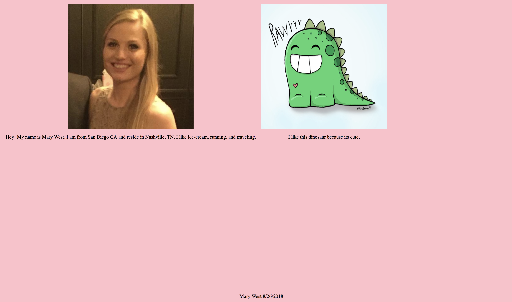

# my-dino

## Technologies Used
1.) HTML
2.) CSS
## Description

This project required us to create a site with our favorite color set to the background, a footer with your name and date.

In addition, this page should have a card with a picture of you and a paragraph about you, and this card should take up half the width of the screen

Lastly, the page should have a card with a picture of your favorite type of dinosaur and a paragraph of why its your favorite dinosaur, and this card should take up half the width of the screen



## How to run this project
* Use npm to intall http-server in your terminal:
```sh
npm install -g http-server
```
* Run the server
```sh
hs -p 9999
```
* Open chrome and navigate to:
```
localhost:9999
```